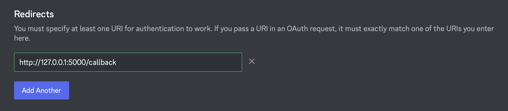
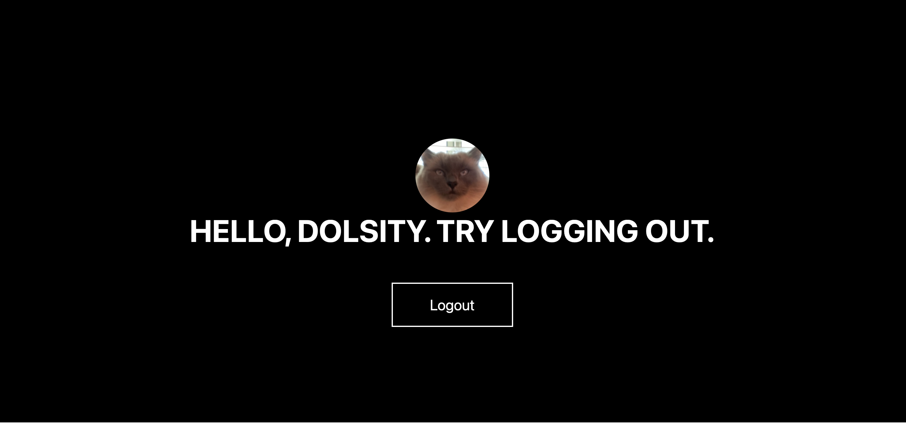

<p align="center">
    
</p>

<h1 align="center">
    Discord Bot using Nextcord and Quart
</h1>

<p align="center">
    Discord leveling made easy
</p>

</p>
<p align="center">
    <a href="https://github.com/dolsity/discord-leveling/issues">
        
    </a>
<a href="https://github.com/dolsity/discord-leveling/pulls">
    
</a>
<br />
<br />
<a href="https://discord.com">
    
</a>
<a href="https://www.python.org/downloads/release/python-3101/">
    
</a>
 <a href="https://docs.nextcord.dev/en/stable/">
    
</a>
<a href="https://www.mongodb.com">
    
</a>

<p align="center">
    <a href="https://github.com/dolsity/nextcord-quart/issues/new/choose">Report Bug</a>
    ·
    <a href="https://github.com/dolsity/nextcord-quart/issues/new/choose">Request Feature</a>
</p>

<h2>Setting up</h2>

**<p>1. Install the requirements</p>**

```python
python3 -m pip install -r requirements.txt
```

**<p>2. Rename `.example_env` to `.env`</p>**

**<p>3. We need to edit the `.env` file now</p>**
- Paste your a secret key of your own where `SECRET_KEY=`
- Paste your mongo uri where `MONGO_URI=`
- Paste your Discord Client ID where `DISCORD_CLIENT_ID=`
- Paste your Discord Client Secret where `DISCORD_CLIENT_SECRET=`

**<p>Make sure to paste the callback url in the redirects of your Discord bot:</p>**



<h2>Preview:</h2>

